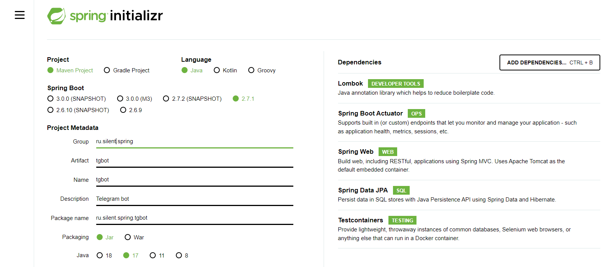

Модуль 36. Hibernate  
ПРАКТИЧЕСКОЕ ЗАДАНИЕ (HW-03)  
В рамках Телеграм-бота, который мы начали разрабатывать в 34 модуле, необходимо реализовать следующее:

- Добавить в тестовые ресурсы, то есть в src/test/resources, два файла: application.properties и data.sql.
- Добавить в файл application.properties свойства, которые сообщают Spring Boot о том, что необходимо выполнить SQL-скрипты из data.sql.
- Добавить в файл data.sql данные для проведения тестов.
- Убедиться в том, что все тесты проходят корректно.4

-- https://github.com/SkillfactoryCoding/JAVA-Spring-skillfactory_bot  
1. https://start.spring.io/
  
2. Обращаемся к сайту ЦБР  
-- обращаемся сюда
http://www.cbr.ru/DailyInfoWebServ/DailyInfo.asmx?op=GetCursOnDate

http://www.cbr.ru/DailyInfoWebServ/DailyInfo.asmx
http://www.cbr.ru/DailyInfoWebServ/DailyInfo.asmx?WSDL
-- как проверить это Curl ?

3. Зарегистрировать нашего бота у BotFather Телеграме и получить у него токен, который мы будем использовать.  

-- добавляем зависимость
```
<dependency>
<groupId>com.github.xabgesagtx</groupId>
<artifactId>telegram-spring-boot-starter</artifactId>
<version>0.26</version>
</dependency>
```
-- pom.xml должен выглядеть так:
https://github.com/SkillfactoryCoding/JAVA-Spring-skillfactory_bot/blob/master/pom.xml